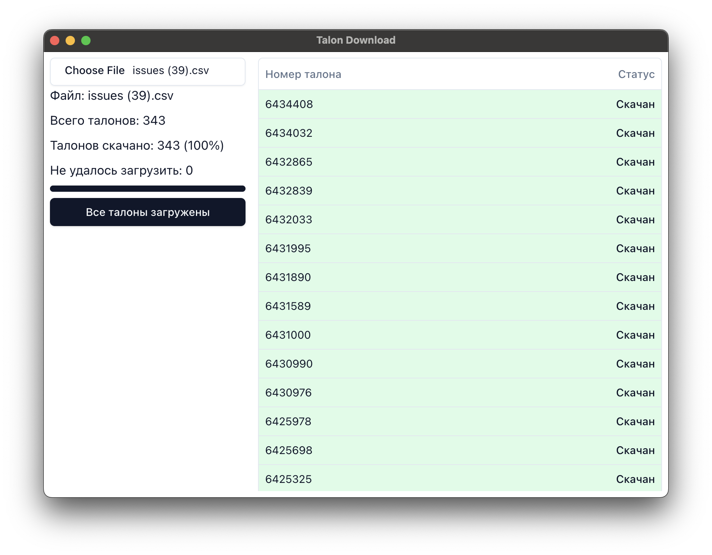

# Talon Download

This project is a solution for a real-world problem. It automates the downloading of PDFs from Redmine.I wrote it for my mom. Part of her work was manually downloading PDF files from a particular source. She received an XLSX file containing a list of IDs that needed to be downloaded. My mother and her team downloaded files manually, searching for files, and this took a long time, not to mention how boring and prone to errors this process was.

So I created this program wrapped into Electron Application for usage simplicity.

Used technologies:

* [ElectronJS](https://www.electronjs.org/)
* [ReactJS](https://react.dev/)
* [Zustand](https://github.com/pmndrs/zustand)
* [Zod](https://zod.dev/)
* [RxJS](https://rxjs.dev/)
* [ShadCN](https://ui.shadcn.com/)
* [TailwindCSS](https://tailwindcss.com/)
* [Vite](https://vite.dev/)
* [PostCSS](https://postcss.org/)

---
